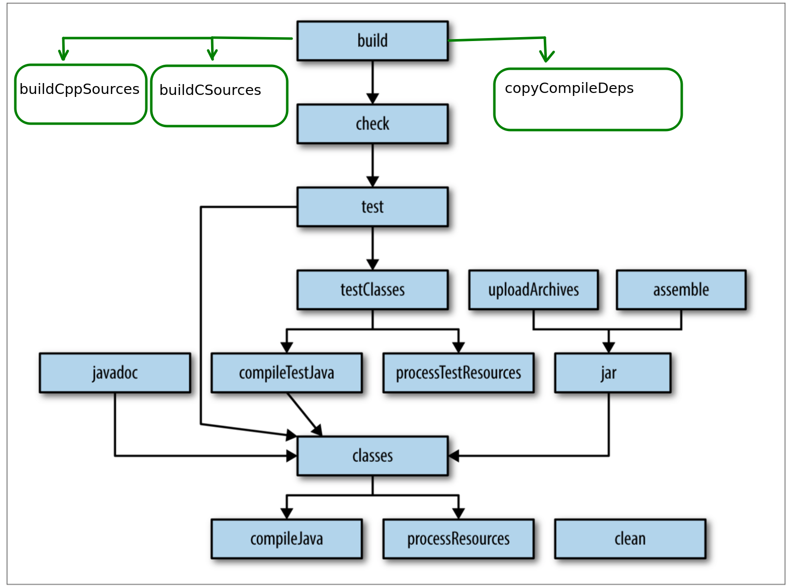

# Java native api (JNI), implementation of popular sorting algorithms using Java, C and C++ 

## Part 1 ( Sorting algorithms Java, native C, native C++ )

- [x] Merge sort
- [x] Quick sort
- [x] Heap sort
- [x] Insertion sort
- [x] Selection sort
- [x] Bubble sort

## Part 2 ( Unit tests: Sorting algorithms Java, native C, native C++ )

- [x] Merge sort
- [x] Quick sort
- [x] Heap sort
- [x] Insertion sort
- [x] Selection sort
- [x] Bubble sort

## Part 3
- [x] Write bash scripts for building Java, C and C++ src. code
- [x] Automate build with gradle + bash scripts
- [x] Add junit5 to project
- [x] Add log4j2 to project

## Part 4 (S.O.L.I.D.)

- [x] Single principle (every entity should have responsibility over a single part of program's functionality.)
- [x] Open closed (entities should be open for extension, but closed for modification.)
- [x] Liskov substitution (if S is a subtype of T, then objects of type T may be replaced with objects of type S without altering any of the desirable properties of the program)
- [x] Interface segregation (no client should be forced to depend on methods it does not use)
- [x] Dependency inversion (High-level modules should not depend on low-level modules. Both should depend on abstractions. Abstractions should not depend on details. Details  should depend on abstractions.) Example package sort with abstract entity SortAlgorithm

## Part 5 (Design Patterns)
- [x] Abstract Factory (com.ivan.app.sort.SortAlgorithmFactory)

## Gradle default + custom build lifecycles

## Useful links

+ https://www.ibm.com/developerworks/systems/library/es-jniexamples.html
+ https://www.owsiak.org/simple-jni-passing-array-from-java-to-c/
+ https://en.wikipedia.org/wiki/SOLID
+ https://en.wikipedia.org/wiki/Heapsort
+ https://www.javatpoint.com/heap-sort

